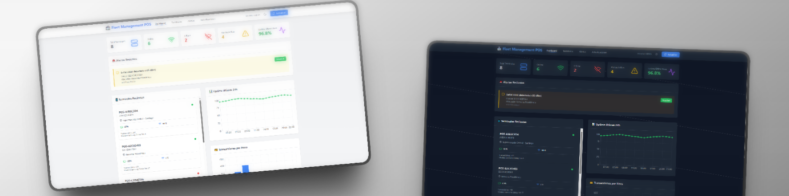
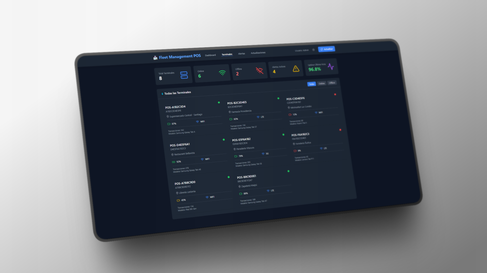
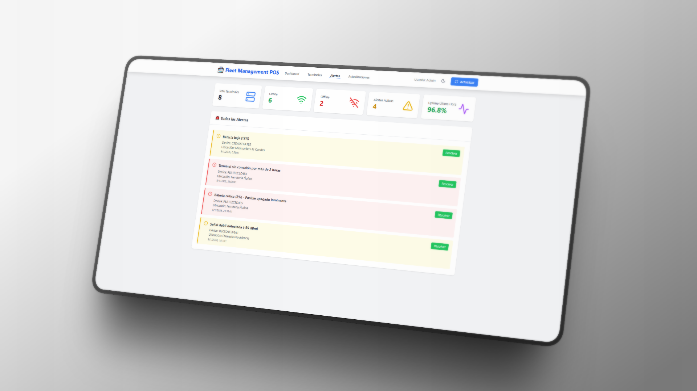
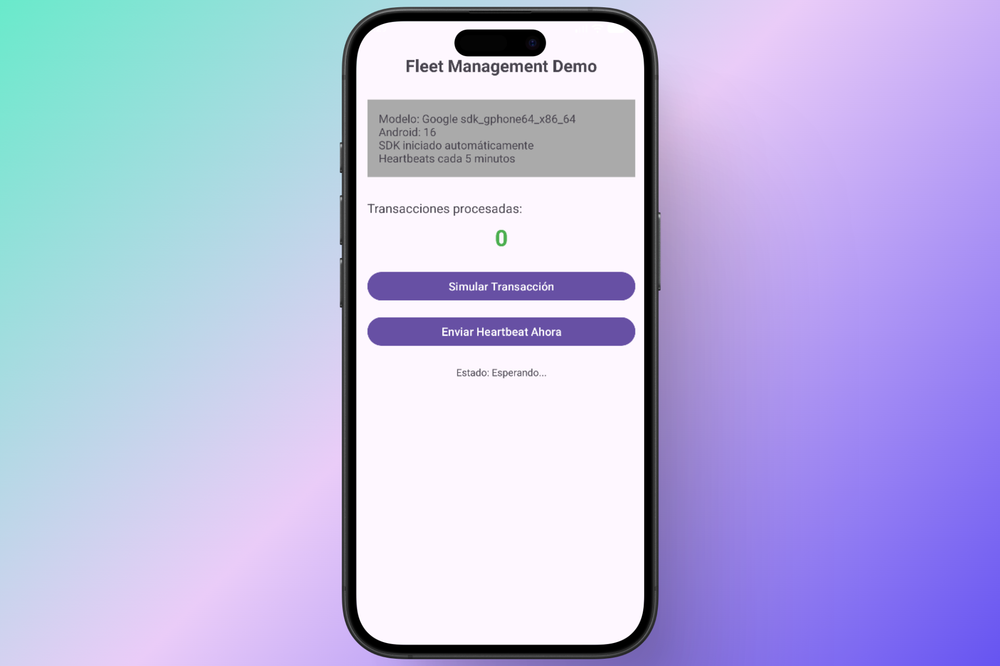

### 🌐 Demo en Vivo
[](https://fleet-management-pos.netlify.app/)
# Fleet Management POS

Sistema completo de monitoreo y gestión de terminales POS (Point of Sale) con dashboard web en tiempo real, backend REST API y SDK Android para integración en apps.


## 📋 Tabla de Contenidos

- [Características](#características)
- [Arquitectura](#arquitectura)
- [Requisitos](#requisitos)
- [Instalación](#instalación)
  - [Backend](#backend)
  - [Dashboard](#dashboard)
  - [Android SDK](#android-sdk)
  - [Demo App](#demo-app)
- [Uso](#uso)
- [API Documentation](#api-documentation)
- [Tecnologías](#tecnologías)
- [Estructura del Proyecto](#estructura-del-proyecto)
- [Screenshots](#screenshots)
- [Licencia](#licencia)

---

## ✨ Características

### 📊 Dashboard Web
- **4 vistas funcionales**: Dashboard, Terminales, Alertas, Actualizaciones
- **Modo oscuro** completo
- **5 métricas en tiempo real**: Total terminales, Online, Offline, Alertas activas, Uptime última hora
- **Gráficos interactivos**: Uptime 24h por hora, Transacciones por hora, Distribución de versiones
- **Actualización automática** cada 5 segundos
- **Responsive** y optimizado para móviles

### 🖥️ Backend
- **14+ endpoints REST** con documentación
- **PostgreSQL** con Docker para persistencia
- **Jobs automáticos**:
  - Cálculo de uptime cada 5 minutos
  - Detección de terminales offline cada 2 minutos
- **6 tipos de alertas automáticas**:
  - Batería crítica (< 10%)
  - Batería baja (< 20%)
  - Terminal offline (> 10 min sin heartbeat)
  - Almacenamiento bajo (< 1 GB)
  - Señal de red débil (< -90 dBm)
  - Acceso no autorizado (> 3 intentos fallidos)
- **WebSocket** configurado para notificaciones en tiempo real

### 📱 Android SDK
- **Recolección automática** de datos del dispositivo:
  - Nivel de batería y estado de carga
  - Tipo de red (WiFi, LTE, 5G)
  - Intensidad de señal
  - Almacenamiento disponible
  - Versión de Android y app
  - Modelo del dispositivo
- **Envío periódico** de heartbeats (configurable)
- **API simple** de integración
- **WorkManager** para tareas en segundo plano
- **Manejo de permisos** automático

---


## 📦 Requisitos

### Backend
- Java JDK 17+
- Gradle 9.2+
- Docker & Docker Compose

### Dashboard
- Node.js 18+
- npm 9+

### Android
- Android Studio Hedgehog o superior
- Android SDK 24+ (Android 7.0+)
- Kotlin 2.0+

---

## 🚀 Instalación

### Backend

1. **Navegar a la carpeta del backend:**
```bash
cd backend
```

2. **Iniciar PostgreSQL con Docker:**
```bash
docker-compose up -d
```

3. **Ejecutar el backend:**
```bash
gradle run --no-configuration-cache
```

El backend estará disponible en `http://localhost:8080`

**Verificar que funciona:**
```bash
curl http://localhost:8080/api/health
```

---

### Dashboard

1. **Navegar a la carpeta del dashboard:**
```bash
cd dashboard
```

2. **Instalar dependencias:**
```bash
npm install
```

3. **Iniciar el servidor de desarrollo:**
```bash
npm run dev
```

El dashboard estará disponible en `http://localhost:5173`

---

### Android SDK

El SDK es una librería Android que se puede integrar en cualquier app.

#### Integración en tu proyecto:

**1. Agregar el SDK como módulo local:**

En `settings.gradle.kts`:
```kotlin
include(":sdk")
project(":sdk").projectDir = File("../ruta/al/sdk")
```

En `app/build.gradle.kts`:
```kotlin
dependencies {
    implementation(project(":sdk"))
}
```

**2. Agregar permisos en AndroidManifest.xml:**
```xml
<uses-permission android:name="android.permission.INTERNET" />
<uses-permission android:name="android.permission.ACCESS_NETWORK_STATE" />
<uses-permission android:name="android.permission.READ_PHONE_STATE" />
```

**3. Inicializar el SDK en tu Application class:**
```kotlin
class MyApplication : Application() {
    override fun onCreate() {
        super.onCreate()
        
        FleetSDK.initialize(
            context = this,
            serverUrl = "http://TU_SERVIDOR:8080/",  // ⚠️ Cambia esta URL
            heartbeatIntervalMinutes = 5L
        )
    }
}
```

**4. Enviar heartbeats manuales (opcional):**
```kotlin
FleetSDK.sendHeartbeat(
    transactionsCount = 10,
    failedLoginAttempts = 0,
    location = "Sucursal Centro",
    onSuccess = { 
        Log.d("SDK", "Heartbeat enviado") 
    },
    onError = { error ->
        Log.e("SDK", "Error: ${error.message}")
    }
)
```

---

### Demo App

1. **Abrir el proyecto en Android Studio:**
```bash
cd demo-app
```

2. **Configurar la URL del servidor:**

Edita `app/src/main/java/com/fleet/demoapp/DemoApplication.kt`:
```kotlin
FleetSDK.initialize(
    context = this,
    serverUrl = "http://TU_IP:8080/",  // ⚠️ Cambiar por tu IP
    heartbeatIntervalMinutes = 5L
)
```

3. **Permitir HTTP (solo para desarrollo):**

Ya está configurado en `network_security_config.xml`

4. **Ejecutar en dispositivo o emulador:**
- Conecta un dispositivo físico (debe estar en la misma red WiFi)
- O usa un emulador
- Click en Run ▶️

---
## 🧪 Scripts de Prueba

Para probar el sistema sin necesidad de dispositivos Android físicos, se incluye un script Node.js que simula terminales enviando heartbeats.

### **Configuración del Script**

1. **Navegar a la carpeta de scripts:**
```bash
cd scripts
```

2. **Instalar dependencias:**
```bash
npm install
```

3. **Configurar la URL del servidor:**

Edita `scripts/send-heartbeats.js` y verifica que la URL sea correcta:
```javascript
const API_URL = 'http://localhost:8080/api';  // ⚠️ Cambia si es necesario
```

4. **Ejecutar el script:**
```bash
npm run send-data
```

### **Qué hace el script:**

- ✅ Simula **8 terminales POS** (6 online, 2 offline)
- ✅ Envía heartbeats cada **5 minutos** para terminales online
- ✅ Genera datos realistas (batería, red, storage, transacciones)
- ✅ Simula diferentes ubicaciones (Supermercado, Farmacia, Restaurant, etc.)
- ✅ Genera alertas automáticas (batería baja, señal débil, acceso no autorizado)


### **Ver resultados:**

Después de ejecutar el script, abre el dashboard en `http://localhost:5173` y verás:
- Las 8 terminales listadas
- 6 terminales online, 2 offline
- Alertas generadas automáticamente
- Gráficos con datos reales
- Métricas actualizándose en tiempo real

**Nota:** Las terminales offline aparecerán después de 2-3 minutos cuando el job automático las detecte.
---
## 🎮 Uso

### Probar el sistema completo

**1. Iniciar Backend:**
```bash
cd backend
docker-compose up -d
gradle run
```

**2. Iniciar Dashboard:**
```bash
cd dashboard
npm run dev
```
Abre `http://localhost:5173`

**3. Ejecutar Demo App:**
- Abre Android Studio
- Configura tu IP en `DemoApplication.kt`
- Run ▶️

**4. Simular actividad:**
- En la app: Click en "Simular Transacción" varias veces
- En la app: Click en "Enviar Heartbeat Ahora"
- En el dashboard: Verás aparecer la nueva terminal con sus datos

**5. Observar alertas automáticas:**
- Batería baja se detecta automáticamente
- Terminales offline después de 10 min sin heartbeat
- Señal débil si < -90 dBm

---

## 📚 API Documentation

### Endpoints principales

#### **Heartbeat**
```http
POST /api/heartbeat
Content-Type: application/json

{
  "deviceId": "ABC123",
  "timestamp": 1704672000000,
  "batteryLevel": 85,
  "batteryCharging": false,
  "networkType": "WIFI",
  "signalStrength": -65,
  "storageAvailable": 5000000000,
  "appVersion": "2.5.0",
  "androidVersion": "13",
  "model": "Samsung Galaxy S21",
  "transactionsCount": 10,
  "failedLoginAttempts": 0,
  "location": "Sucursal Centro"
}
```

#### **Obtener estadísticas**
```http
GET /api/stats
```

#### **Listar terminales**
```http
GET /api/terminals
GET /api/terminals?status=online
```

#### **Obtener alertas activas**
```http
GET /api/alerts
```

#### **Resolver alerta**
```http
PUT /api/alerts/{id}/resolve
```

[Ver documentación completa de la API](./docs/API.md)

---

## 🛠️ Tecnologías

### Backend
- **Kotlin** + **Ktor** - Framework web
- **PostgreSQL** - Base de datos
- **Exposed** - ORM
- **HikariCP** - Connection pooling
- **Docker** - Containerización

### Dashboard
- **React 18** + **TypeScript**
- **Vite** - Build tool
- **Tailwind CSS** - Styling
- **Recharts** - Gráficos
- **Axios** - HTTP client

### Android SDK
- **Kotlin**
- **Retrofit** - HTTP client
- **WorkManager** - Background tasks
- **Gson** - JSON serialization
- **Coroutines** - Async operations

---

## 📁 Estructura del Proyecto
```
fleet-management-pos/
├── backend/                 # Backend Kotlin + Ktor
│   ├── app/src/main/kotlin/com/fleet/
│   │   ├── Application.kt
│   │   ├── routes/
│   │   ├── services/
│   │   ├── database/
│   │   └── models/
│   ├── docker-compose.yml
│   └── build.gradle.kts
│
├── dashboard/              # Dashboard React + TypeScript
│   ├── src/
│   │   ├── components/
│   │   ├── api/
│   │   ├── contexts/
│   │   └── types/
│   ├── package.json
│   └── vite.config.ts
│
├── android-sdk/           # SDK Android
│   └── sdk/src/main/java/com/fleet/sdk/
│       ├── FleetSDK.kt
│       ├── models/
│       ├── network/
│       ├── collectors/
│       └── worker/
│
├── demo-app/             # Demo App Android
│   └── app/src/main/java/com/fleet/demoapp/
│       ├── MainActivity.kt
│       └── DemoApplication.kt
│
├── scripts/              # Scripts de prueba
│   └── send-heartbeats.js
│
└── README.md
```

---

## 📸 Screenshots

### Dashboard - Vista Principal


### Dashboard - Modo Oscuro


### Vista de Terminales


### Vista de Alertas


### Demo App Android


---

## 📄 Licencia

Este proyecto está bajo la Licencia MIT. Ver el archivo [LICENSE](LICENSE) para más detalles.


⭐ Si este proyecto te fue útil, considera darle una estrella en GitHub!
